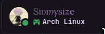
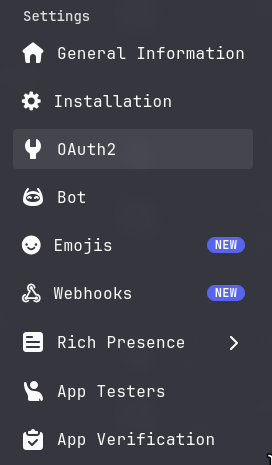
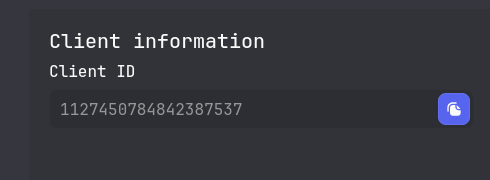
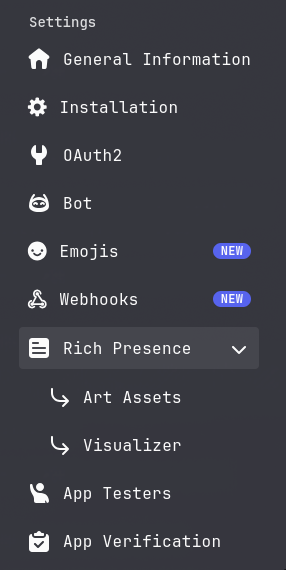
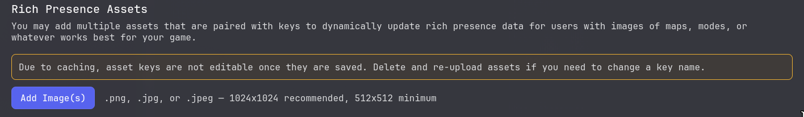
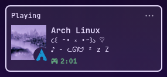

# LinuxRPC
LinuxRPC is a simple and customizable Discord RPC client made in Rust for Arch Linux (compatability for other distros coming soon).

It will cycle through images and messages you set every 10 seconds, as well as show what you are listening to on media players (Currently locked to Spotify for the time being)

## Installing (Coming Soon)

## Manually Building

```bash
$ git clone https://github.com/Sinmysize/LinuxRPC.git
$ cd LinuxRPC
$ makepkg -si
```

After building, it is highly recommended you run `systemctl --user enable linuxrpc.service` as to ensure everything runs properly.

## Configuration

You can find the configuration file in `~/.config/LinuxRPC/config.rpc`.

Copy this config template into your config file and fill out your client ID

```
[clientId]
<YOUR CLIENT ID>

[icons]

[messages]

[default_icon]

[default_small_icon]

[default_icon_text]

[default_small_text]

```

### Variables

- **[clientId]**: The client ID you get from your application.

- **[icons]**: The big picture you see in the rich presence.
- **[messages]**: Any message you would like to display (Try keeping it under 20 characters). Each message should be separated by a new line.
- **[default_icon]**: The picture that will default as your icon if none is set.
- **[default_small_icon]**: The small picture in the bottom right corner of your icon. This will be the default picture that is set.
- **[default_icon_text]**: The text that appears when you hover over your icon.
- **[default_small_text]**: The text that appears when you hover over your small icon.

## Setting Up the Application

In order to add pictures to your RPC client, you will first have to create an application on Discord and acquire the Client ID.

### Getting the Client ID
In order to get your Client ID, go to https://discord.com/developers/applications/ (Be sure to login if you have not done so).

Next, click `New Application` give it a name (This will be the name that shows up as your status). You will then be redirected to the application's page.



Then, go to `OAuth2` on the side and under **Client Information**, you will find the Client ID




(The Client ID for this example is invalid)

Lastly, in your config file, paste your Client ID under **[clientId]** and run `linuxrpc run` in your terminal to test if it works. 

Example:
```
[clientId]
1127450784842387537 
```
If you get the message `Connected!`, then you have successfully created the application.

### Adding Pictures

In order to add pictures to your RPC Client, go to your application's page and go to the `Rich Presence` tab on the side.



Next, under **Rich Presence Assets** click **Add Image(s)** and select any image you would want to appear in your RPC client.



Then, give the image(s) a name (you will need these names later).

Lastly, in your config (or do `linuxrpc config`, `Edit Config` > `Add to config` > `icons` or `default_icon` or `default_small_icon`), add the name of each image you added.

Run `linuxrpc run` to test if it works. If you do everything correctly, it should display the image(s) you added.

