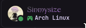
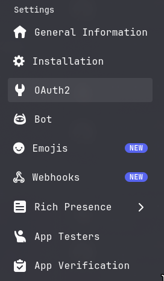
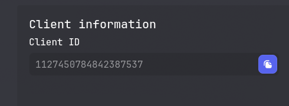
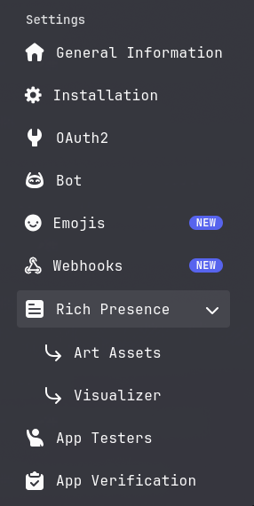
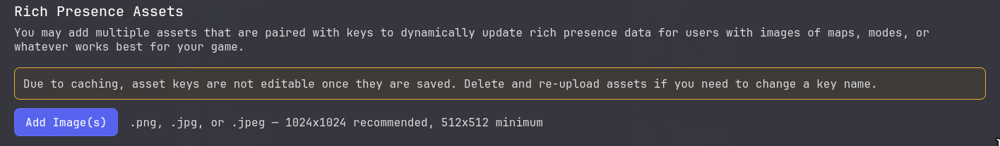

# LinuxRPC
LinuxRPC is a simple and customizable Discord RPC client made in Rust for a variety of Linux distros.

This program cycles through images and messages you set every 10 seconds, as well as show what you are listening to on most media players.

## Contents
[Building](#building)

[Setting up an Application](#setting-up-an-application)
- [Getting a Client ID](#getting-a-client-id)
- [Adding Pictures](#adding-pictures)

[Creating a Config File](#creating-a-config-file)

[Configuration](#configuration)
- [Variables](#variables)
- [Choosing a Media Player](#choosing-a-media-player)

[Running Program](#running-program)

[Auto-running Program](#auto-running-program)

## Building

### Arch Linux & Arch-based Distros
```bash
git clone https://github.com/Sinmysize/LinuxRPC.git
cd LinuxRPC
makepkg -si
```

### Universal
```bash
https://github.com/Sinmysize/LinuxRPC.git
cd LinuxRPC
cargo install --path "path" # Must have cargo installed

# Add this to your .bashrc, .zshrc, etc. if you have not
export PATH=~/.cargo/bin:$PATH
```

## Setting up an Application
In order to add pictures to your RPC client, you will first have to create an application on Discord and acquire the Client ID.

### Getting a Client ID
In order to get your Client ID, go to https://discord.com/developers/applications/ (Be sure to login if you have not done so).

Next, click `New Application` give it a name (This will be the name that shows up as your status). You will then be redirected to the application's page.



Then, go to `OAuth2` on the side and under **Client Information**, you will find the Client ID




(The Client ID for this example is invalid)

### Adding Pictures
In order to add pictures to your RPC Client, go to your application's page and go to the `Rich Presence` tab on the side.



Next, under **Rich Presence Assets** click **Add Image(s)** and select any image you would want to appear in your RPC client.



Then, give the image(s) a name (you will need these names later).

## Creating a Config File
Creating a config file is very easy if you use the **Create Config** option in the [CLI config](#configuration)

You are able to manually create config files in the `.config/LinuxRPC` directory. Ensure the file ends with `.rpc` so the program knows to read the config.

## Configuration
To edit, create, and remove configs, use the provided CLI by running `linuxrpc config`.

Below are the variables in each config. 

### Variables

- **[clientId]**: The client ID you get from your application.

- **[icons]**: The big picture you see in the rich presence.
- **[messages]**: Any message you would like to display (Try keeping it under 20 characters). Each message should be separated by a new line if you manually edit the file.
- **[default_icon]**: The picture that will default as your icon if none is set. It will default to a placeholder image by discord if none is set.
- **[default_small_icon]**: The small picture in the bottom right corner of the icon. This will be the default picture that is set.
- **[default_icon_text]**: The text that appears when you hover over your icon.
- **[default_small_text]**: The text that appears when you hover over your small icon.
- **[player]**: The player you wish to be displayed (Ex: spotify, your browser, etc.)

### Choosing a Media Player
You can display what song you are listening to by setting what media player in the config.

The program uses playerctl to get the information from the chosen player, so any player that playerctl can detect can work.

The name is case sensitive to the config so ensure you find the proper name of the player. To find out the name of the media player, do `playerctl -l` and choose the name of the player. In some cases for browsers, it may contain other things besides the name. An example of this can be found by Firefox where it will show `firefox.instance_...`.
This is not a problem as you can simply but `firefox` and it will still work. Feel free to create an issue if a media player does not work.

> **CAUTION** IF YOU SET THE PLAYER TO YOUR PLAYER, **IT WILL DISPLAY <u>ANY</u> VIDEO OR SONG YOU ARE LISTENING TO ON YOUR BROWSER! YOU HAVE BEEN WARNED!**

## Running Program
If you manually built the binary, I recommend putting the executable in `/usr/bin` or `/usr/local/bin` for easier use. But you can keep the executable anywhere, just ensure the path points to it: `/path/to/linuxrpc`.

To start the RPC client, simply run `linuxrpc start` and it will run in the background.

For testing purposes, such as testing your configs, you can use `linuxrpc run` which will allow you to exit when needed or give errors if something should fail.

## Auto-running Program
Since I believe forcing the program to auto run feels like a violation of the user's choice, I decided to allow the user to choose whether they want to let it auto run or manually run it.

You can choose however to handle the auto run, whether through a config file, a service, or a chrontab.

#
### **Here are a few examples for it to auto run on startup.**

### Hyprland Config
You can add this line to your hyprland.conf file
```
exec-once = linuxrpc run
```

### Sway/i3 Config
You can add this line to your config file
```
exec linuxrpc run
```

### Systemd
You can create a systemd service to run
```
[Unit]
Description=A simple and customizable RPC client for discord on Linux made with Rust
After=network.target

[Service]
Type=simple
ExecStart=/usr/bin/linuxrpc run
Restart=on-failure
RestartSec=10

[Install]
WantedBy=default.target
```